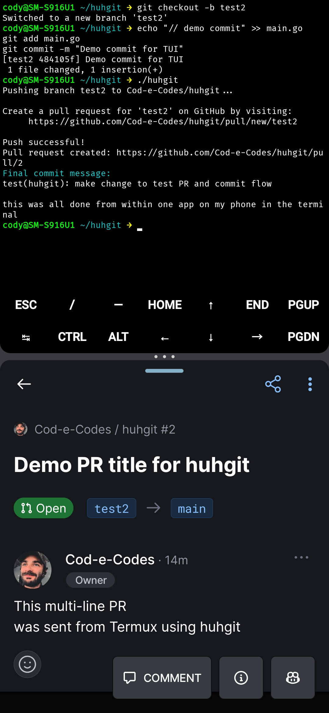

# huhgit




`huhgit` is a terminal-based tool for interacting with GitHub repositories. It provides a TUI for pushing branches, creating pull requests, and generating conventional commits, all from the command line.

## Latest Release

Version 1.0.0 is available with pre-built binaries for Windows, Linux, macOS, and Android. Download from the [releases page](https://github.com/Cod-e-Codes/huhgit/releases/latest).

## Features

* Push local branches to a remote repository.
* Create pull requests with title and body input.
* Generate conventional commit messages interactively.
* Terminal-native interface with themes for a clean workflow.

## Requirements

* Go 1.21+
* Git installed and initialized in the repository
* GitHub Personal Access Token with repo permissions (`GITHUB_TOKEN` environment variable)

## Installation

### Pre-built Binaries

Download the appropriate binary for your platform from the [releases page](https://github.com/Cod-e-Codes/huhgit/releases/latest):

- Windows: `huhgit-windows-amd64.exe` or `huhgit-windows-arm64.exe`
- Linux: `huhgit-linux-amd64` or `huhgit-linux-arm64`
- macOS: `huhgit-darwin-amd64` or `huhgit-darwin-arm64`
- Android: `huhgit-android-arm64` or `huhgit-android-amd64`

### From Source

1. Clone the repository:

   ```bash
   git clone https://github.com/Cod-e-Codes/huhgit.git
   cd huhgit
   ```

2. Build the tool:

   ```bash
   go build
   ```

## Usage

1. Set your GitHub token:

   ```bash
   export GITHUB_TOKEN=your_personal_access_token
   ```

2. Run the TUI:

   ```bash
   ./huhgit
   ```

3. Follow the prompts to push, create a pull request, and commit changes.

## License

This project is licensed under the MIT License. See the [LICENSE](LICENSE) file for details.

